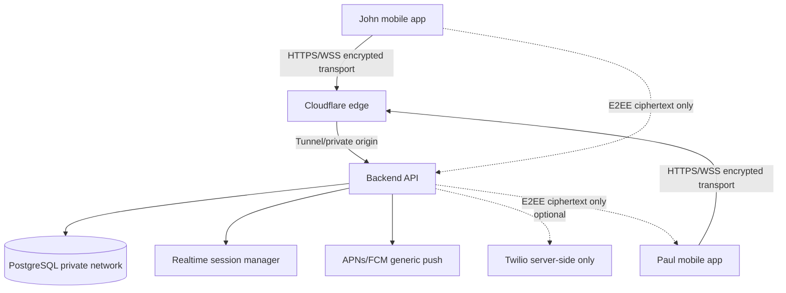
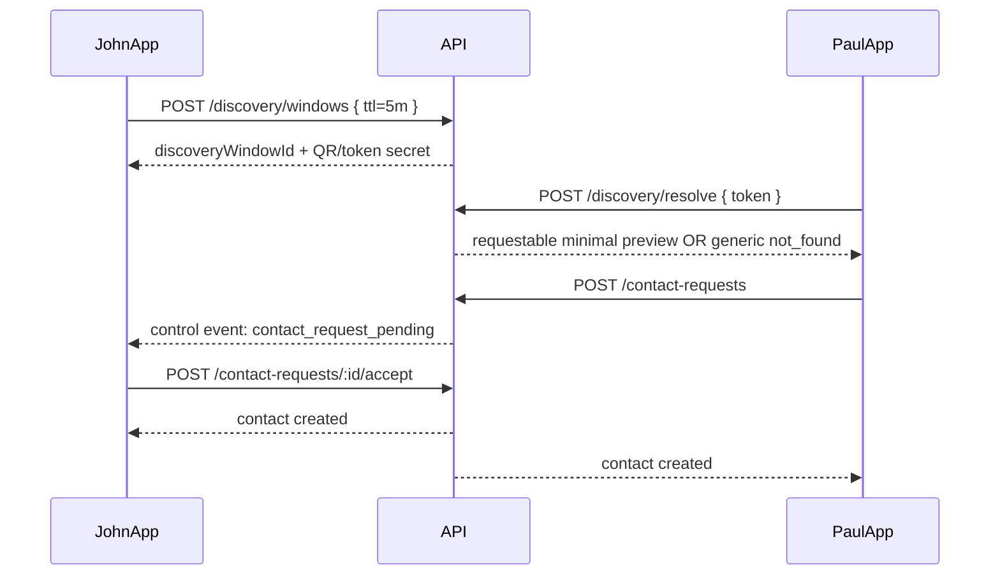
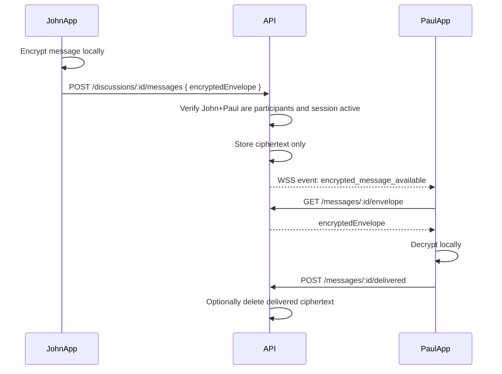
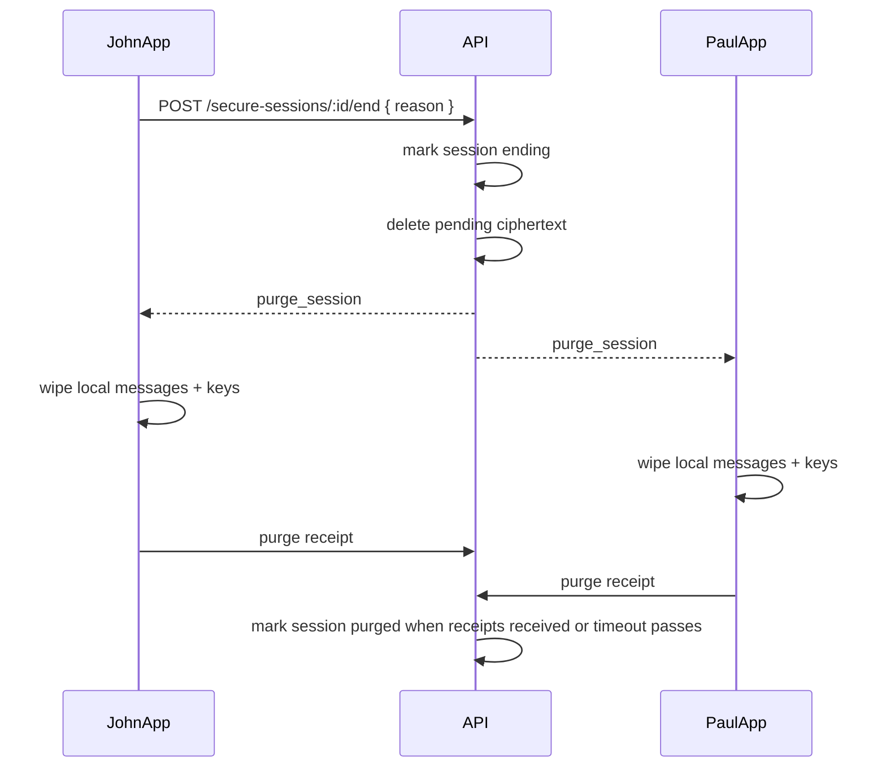

# Privacy App Stage 1 — Cursor Master Document
Generated: 2026-06-02


---

<!-- Source file: 00_CURSOR_START_HERE.md -->


# Cursor Start Here — Privacy-First Secure Communications App

Generated: 2026-06-02

This is the Stage 1 planning/build package for a private, end-to-end encrypted mobile communications app. The goal of this package is to give Cursor enough structure to begin implementation without re-asking the same architecture questions.

## Product direction

Build a private iPhone/Android app where:

- App-to-app messages are **not SMS**.
- The server **must never receive plaintext message bodies**.
- Users are **not publicly searchable**.
- Discovery is **off by default** and can be enabled intentionally for **5 minutes**.
- Discovery uses an exact temporary token or QR code, not a public name search.
- Secure chat sessions are live-session based.
- If either participant disconnects, both sides purge the session.
- Screenshot and screen-recording events notify both users and can optionally end/purge the session.
- Twilio is optional/fallback for voice or external phone/SMS use only; Twilio credentials never go in the mobile app.
- Real server origin IP is hidden behind a protected edge/private tunnel.

## How to use this pack in Cursor

1. Create a new private GitHub repository.
2. Unzip this pack into the repository root.
3. Open the repo in Cursor.
4. Confirm `.cursor/rules/*.mdc` appears in the repo.
5. Open `99_CURSOR_BUILD_PROMPT.md`.
6. Paste that file into Cursor Agent and run it.
7. Do **not** let Cursor build crypto from scratch. It must choose audited/proven libraries and leave hard blockers where a security review is required.

## Recommended first Cursor task

Ask Cursor:

> Read `00_CURSOR_START_HERE.md`, `docs/01_PRODUCT_REQUIREMENTS.md`, `docs/02_ARCHITECTURE.md`, `docs/03_SECURITY_PRIVACY_THREAT_MODEL.md`, and `docs/07_GITHUB_REUSE_RESEARCH.md`. Then create a monorepo skeleton with mobile, backend, shared types, database schema, tests, and placeholder crypto interfaces. Do not implement real cryptography yet. Do not add any plaintext message body server fields.

## Stage 1 output definition

Stage 1 is complete when the repo contains:

- Product requirements
- Architecture design
- Security/privacy threat model
- E2EE strategy
- API contracts
- Database schema draft
- GitHub reuse research
- Infrastructure/security plan
- TestFlight/private beta plan
- Build roadmap
- Cursor rules

This package includes all of those.


---

<!-- Source file: 99_CURSOR_BUILD_PROMPT.md -->


# Cursor Agent Prompt — Build From Stage 1 Pack

You are building a privacy-first secure communications app from the documents in this repository.

## Non-negotiable requirements

1. The server must never receive plaintext message bodies.
2. App-to-app messaging must be E2EE. Server stores/routes ciphertext only.
3. Do not create any backend column named `body`, `plaintext`, `message_text`, or similar for app-to-app messages.
4. No public user search. No `GET /users/search?name=` endpoint.
5. Discovery is off by default and only active for 5 minutes when the discovered user intentionally enables it.
6. Discovery requires exact temporary token/QR. Wrong, expired, inactive, or non-existent tokens return the same generic response.
7. Both participants must approve/accept before a secure discussion can start.
8. If either participant disconnects, secure session ends and both devices receive purge instructions.
9. Screenshot/screen-recording events must be secure control events. They must not include message content.
10. Twilio credentials are server-side only. Never include Twilio Account SID/Auth Token/API Secret in mobile code.
11. The origin server must be private behind Cloudflare Tunnel or equivalent private origin architecture.
12. Do not invent custom cryptography. Use interfaces first, then integrate proven audited libraries after license review.
13. Do not log message ciphertext unnecessarily; never log plaintext or decrypted content.
14. Push notifications must be generic: “New message” only.

## Build sequence

Start with a monorepo:

```text
apps/mobile          React Native app
apps/api             Node/NestJS or Fastify backend
packages/shared      shared TypeScript types and validation schemas
packages/crypto      crypto interfaces and adapters
packages/db          Prisma schema and database migrations
infra                Docker Compose, Cloudflare Tunnel notes, deployment docs
docs                 architecture/spec/test docs
```

Recommended stack:

- React Native with TypeScript for mobile.
- Node.js 22+ with TypeScript for backend.
- PostgreSQL for persistence.
- Prisma for data modeling.
- WebSocket layer for live secure sessions and heartbeats.
- Passkey/WebAuthn or passkey-ready auth path.
- React Native Keychain / iOS Keychain / Android Keystore for device-private keys.

## First implementation checkpoint

Create code skeleton only:

- Mobile navigation screens:
  - Welcome/Auth
  - Device setup
  - Private discovery
  - Contact request
  - Secure session room
  - Settings/devices
- Backend modules:
  - auth
  - devices/prekeys
  - discovery
  - contacts
  - discussions
  - secure sessions
  - encrypted messages
  - control events
  - webhooks/twilio optional
- Shared types:
  - UserId, DeviceId, DiscussionId, SecureSessionId
  - EncryptedEnvelope
  - DiscoveryWindow
  - SecureControlEvent
- Database schema from `docs/04_DATA_MODEL_PRISMA.prisma`.
- Tests that fail if a plaintext message body field is added to server-side message types.

## Important implementation instruction

For encryption, create the interfaces and tests first:

```ts
interface CryptoEngine {
  generateDeviceIdentity(): Promise<DeviceIdentityPublicBundle>;
  createOutboundSession(input: OutboundSessionInput): Promise<OutboundSession>;
  encryptMessage(input: EncryptMessageInput): Promise<EncryptedEnvelope>;
  decryptMessage(input: DecryptMessageInput): Promise<PlaintextForLocalDeviceOnly>;
}
```

The backend must never import decrypt functions for app-to-app messages.

Use `FakeCryptoEngine` only in local UI tests, with loud warnings. Production builds must fail if fake crypto is enabled.

## After skeleton

Work checkpoint by checkpoint from `docs/10_BUILD_ROADMAP.md`.


---

<!-- Source file: docs/01_PRODUCT_REQUIREMENTS.md -->


# Product Requirements Document

## Working product name

PrivateComms MVP

## Primary goal

Create a private mobile communications app for a small private beta under 100 testers. The app enables intentionally discovered, approved users to communicate inside live, end-to-end encrypted sessions. The server routes encrypted data only and cannot read messages.

## Target users for MVP

- Internal owner/founder
- Developer/test team
- Under 100 trusted beta users via TestFlight and Android internal/closed testing

## Core MVP features

### 1. Account/device setup

- User can create an account with a private display name.
- User identity is not globally searchable.
- Device creates and stores local encryption private keys.
- Server receives public identity/prekey material only.
- User can see linked devices.
- User can revoke a device.

### 2. Timed private discovery

- Discovery is off by default.
- User manually enables discovery for 5 minutes.
- App displays temporary QR code and short code.
- Another user can scan/enter the exact token.
- Server returns no public search results.
- Wrong/expired/inactive tokens receive generic responses.
- Discovered user must approve connection before any discussion is created.
- Discovery token expires early if used, cancelled, backgrounded, logged out, or heartbeat expires.

### 3. Contact request and approval

- Discoverer sends connection request.
- Discovered user accepts/rejects.
- Only accepted connections can start secure sessions.
- Pairwise internal contact IDs are created after acceptance.
- Display name can be shown after approval.

### 4. End-to-end encrypted messaging

- App-to-app messages are not SMS.
- Sender app encrypts locally.
- Server stores/routes ciphertext only.
- Recipient app decrypts locally.
- Server cannot decrypt messages.
- Message keys rotate per message/session depending on chosen crypto protocol.
- Server must not have a plaintext message field.

### 5. Live secure sessions

- A secure session requires both users online.
- Messages only exist while the session is active.
- Heartbeats maintain presence.
- If either user disconnects, app backgrounds, logs out, or heartbeat expires, the session ends.
- Server deletes pending ciphertext and sends purge commands to both devices.
- Devices delete local message cache and session keys.

### 6. Screenshot/screen recording controls

- If screenshot is detected, both users are notified.
- If screen recording/capture is detected where supported, both users are notified.
- Strict mode can end and purge the session on screenshot/capture.
- App must clearly state limitations: detection is OS-dependent and cannot prevent external-camera photos.

### 7. Twilio optional/fallback

- Twilio may be used for phone verification, app-to-phone voice, or SMS fallback to non-app users later.
- Twilio is not used for app-to-app encrypted messages.
- Twilio credentials are server-side only.
- Do not implement SMS fallback until core E2EE app messaging is stable.

### 8. Server IP protection

- Mobile app calls only domain names such as `api.example.com` and `wss.example.com`.
- Backend origin must not expose public inbound ports.
- Use Cloudflare Tunnel or equivalent private origin.
- Database is private network only.
- Admin access requires Zero Trust/VPN/MFA.

## Explicit non-goals for MVP

- No public user directory.
- No search by name, phone number, or email.
- No “people nearby.”
- No contact-book upload.
- No group chat.
- No cloud message backup.
- No unreviewed production crypto.
- No real sensitive user conversations during early TestFlight beta.

## MVP success criteria

- Two testers can intentionally discover each other using a 5-minute QR/token flow.
- Both users approve the connection.
- Both enter a live secure session.
- Server receives ciphertext only.
- Either disconnect triggers purge on both devices.
- Screenshot event notifies both users.
- Backend tests prove no plaintext message body storage exists.
- All logs are free of plaintext messages and private keys.


---

<!-- Source file: docs/02_ARCHITECTURE.md -->


# Architecture

## Recommended MVP stack

```text
Mobile:        React Native + TypeScript
Backend:       Node.js 22+ + TypeScript + NestJS or Fastify
Database:      PostgreSQL
ORM:           Prisma
Realtime:      WebSockets
Crypto:        Proven E2EE library/protocol adapter, not custom crypto
Auth:          Passkey-ready WebAuthn path, device/session tokens
Storage:       No plaintext message storage; encrypted attachments only
Edge:          Cloudflare Tunnel or equivalent private origin
Twilio:        Optional voice/SMS fallback server-side only
```

## High-level system diagram



## Monorepo layout

```text
apps/mobile/
  src/
    screens/
    navigation/
    crypto/
    session/
    discovery/
    storage/
    native/screenshot/
apps/api/
  src/
    auth/
    devices/
    discovery/
    contacts/
    discussions/
    secure-sessions/
    encrypted-messages/
    control-events/
    twilio/optional/
packages/shared/
  src/types.ts
  src/schemas.ts
packages/crypto/
  src/CryptoEngine.ts
  src/FakeCryptoEngine.dev-only.ts
  src/adapters/
packages/db/
  prisma/schema.prisma
infra/
  docker-compose.yml
  cloudflare-tunnel.md
  env.example
docs/
```

## Trust boundaries

### Trusted only on user devices

- Decrypted message content
- Private identity keys
- Session keys
- Message keys
- Attachment keys

### Trusted on backend

- Auth/session verification
- Authorization checks
- Discovery window state
- Contact relationship state
- Routing of encrypted envelopes
- Generic push notifications
- Delete/purge coordination

### Not trusted

- Client-supplied `fromUserId`
- Client-supplied recipient phone numbers
- Client-supplied discussion membership claims
- Public network metadata
- Push notification providers for message secrecy
- Mobile OS screenshot prevention guarantees

## Core flow: timed private discovery



## Core flow: encrypted message



## Core flow: delete on disconnect



## Realtime behavior

- WebSocket connection authenticated with short-lived access token.
- Heartbeat every 5 seconds.
- Heartbeat timeout 15-30 seconds for network loss.
- Manual end/logout/background events end immediately.
- Server must reject messages after session status is not `ACTIVE`.

## Mobile local data rules

- Store private device keys in platform secure storage/keychain/keystore.
- Store decrypted messages in memory only where possible.
- If local cache is required, store encrypted cache and keep session key in memory.
- Wipe memory/cache on session end/background/logout.
- Hide app switcher previews.
- Use generic notifications.

## Backend logging rules

Allowed:

- request id
- user id
- device id
- discussion id
- secure session id
- event type
- timestamps
- redacted IP / coarse metadata if needed

Forbidden:

- plaintext messages
- decrypted attachments
- private keys
- full discovery token secrets
- Twilio auth token
- passkey private material
- recovery secrets


---

<!-- Source file: docs/03_SECURITY_PRIVACY_THREAT_MODEL.md -->


# Security and Privacy Threat Model

## Primary privacy promises

1. The server cannot read app-to-app message content.
2. Users are not publicly searchable.
3. Discovery requires intentional opt-in and expires after 5 minutes.
4. Messages are temporary and purge on disconnect.
5. Screenshot/screen-capture events are visible to both participants where OS support allows.
6. Origin server IP is not directly reachable by the public internet.

## Assets to protect

- Message plaintext
- Attachment plaintext
- Device private keys
- Session/message keys
- User social graph
- Discovery tokens
- Push notification content
- Server origin IP
- Twilio credentials
- Passkey/account recovery credentials

## Adversaries

- Random internet scanner
- Abusive user trying to enumerate accounts
- Abusive user trying to screenshot/save messages
- Attacker with stolen account session token
- Attacker with database read access
- Attacker with backend log access
- Compromised or rooted/jailbroken device
- Insider with infrastructure access
- Network attacker
- Bot attempting token guessing

## Threats and controls

| Threat | Control |
|---|---|
| User enumeration by name | No public search, exact token only, generic errors |
| Discovery token guessing | High entropy tokens, hashing, rate limits, 5-minute TTL, one-time use |
| Server reads messages | E2EE; backend receives ciphertext only; no decrypt functions server-side |
| DB leak reveals messages | Store ciphertext only; no keys in DB that allow server decryption |
| Logs leak private content | Logging denylist; tests; redaction; no message content in crash/analytics |
| Push notifications leak messages | Generic push only, local decrypt if notification shown |
| Screenshot without warning | iOS/Android capture hooks where available; notify both users |
| Screenshot prevention bypass | State limitation clearly; strict mode purges on detection; device integrity checks |
| Late message after disconnect | Server session state machine rejects new messages; purge commands |
| Origin IP attack | Cloudflare Tunnel/private origin; block direct public inbound access |
| Twilio credential exposure | Use twilio-node only backend; env vars/secrets manager |
| New device impersonation | safety codes/QR verification; key-change warnings; device list/revocation |
| Malicious client sends to non-participant | Server validates discussion/contact/session authorization every request |
| Contact scraping | No contact book upload by default; no phone/email lookup |

## Security invariants

The following must be enforced by tests:

- `EncryptedMessage` server-side model has no plaintext fields.
- Message send endpoint rejects if recipient is not an active participant.
- Discovery resolve endpoint returns generic error for not found/expired/cancelled/wrong token.
- Discovery windows expire after 5 minutes or earlier if cancelled/backgrounded/disconnected.
- Secure session rejects new messages after ending/ended/purged.
- Purge event is sent to both participants on disconnect.
- Screenshot/screen capture event sends control event only, no message content.

## Crypto approach

Do not implement custom cryptography. The build should begin with interfaces and test stubs, then integrate a proven protocol/library after license and security review.

Candidate protocols/libraries are described in `docs/07_GITHUB_REUSE_RESEARCH.md`.

## Screenshot limitations

- iOS screenshot notification fires after the screenshot is taken.
- Android screenshot detection is Android 14+ and limited to specific screenshot methods.
- Android FLAG_SECURE can help block screenshots but may prevent screenshot callbacks from firing.
- No app can prevent a second device from photographing the screen.
- Rooted/jailbroken/compromised devices can bypass app-level protections.

## Key-change policy

If a user's identity key changes:

- Freeze affected discussions.
- Notify contact(s).
- Require re-verification before new secure sessions.
- Do not deliver old messages to new device automatically.
- Delete active live-session content.

## Purge policy

When purge is triggered:

- Server marks secure session ending.
- Server deletes pending ciphertext/encrypted attachments.
- Server sends `purge_session` to both devices.
- Devices wipe decrypted message memory, local encrypted cache, attachment cache, and session keys.
- Devices return signed purge receipt.
- Server keeps only non-content audit metadata.


---

<!-- Source file: docs/05_API_CONTRACTS.md -->


# API Contracts Draft

Base URL: `https://api.example.com`

All endpoints require HTTPS. Authenticated endpoints require a short-lived access token. WebSocket events use WSS only.

## Important API rule

For app-to-app messaging, the client must never send a plaintext `body` field to the backend. The backend only accepts encrypted envelopes.

## Auth/device setup

### POST /auth/passkey/register/options

Starts passkey registration.

### POST /auth/passkey/register/verify

Verifies passkey registration and creates account/device session.

### POST /auth/passkey/login/options

Starts passkey login.

### POST /auth/passkey/login/verify

Verifies passkey login and returns app access token.

### POST /devices/register-crypto-bundle

Registers device public keys/prekeys.

Request:

```json
{
  "deviceId": "dev_123",
  "identityPublicKey": "base64",
  "signedPrekeyPublic": "base64",
  "signedPrekeySignature": "base64",
  "oneTimePrekeys": [
    { "prekeyId": "1", "publicKey": "base64" }
  ]
}
```

## Timed private discovery

### POST /discovery/windows

Creates a 5-minute discovery window for the authenticated user.

Request:

```json
{ "ttlSeconds": 300, "mode": "quick" }
```

Response:

```json
{
  "discoveryWindowId": "dw_123",
  "expiresAt": "2026-06-02T18:05:00Z",
  "shortCode": "8KQ7-MP42-LZ9A",
  "qrPayload": "app://discover/..."
}
```

Server storage: store only token hash, not raw token.

### DELETE /discovery/windows/:id

Cancels user's active discovery window.

### POST /discovery/resolve

Resolves an exact discovery token.

Request:

```json
{ "token": "8KQ7-MP42-LZ9A" }
```

Success response:

```json
{
  "status": "requestable",
  "discoveryWindowId": "dw_123",
  "displayNamePreview": "John",
  "safetyCodePreview": "optional-short-fingerprint"
}
```

Generic failure response for all failure modes:

```json
{ "status": "not_found" }
```

Do not distinguish expired, cancelled, not found, inactive, or rate limited in normal client response.

## Contact requests

### POST /contact-requests

Creates request after valid discovery resolve.

Request:

```json
{ "discoveryWindowId": "dw_123" }
```

### POST /contact-requests/:id/accept

Target user accepts. Creates contact pair and discussion.

### POST /contact-requests/:id/reject

Target user rejects. No discussion created.

## Discussions and secure sessions

### POST /discussions/:discussionId/secure-sessions

Starts live secure session if both participants are allowed.

Response:

```json
{
  "secureSessionId": "sess_123",
  "status": "ACTIVE",
  "heartbeatIntervalSeconds": 5,
  "heartbeatTimeoutSeconds": 20
}
```

### POST /secure-sessions/:id/heartbeat

Updates participant presence.

### POST /secure-sessions/:id/end

Ends session and triggers purge.

Request:

```json
{ "reason": "user_disconnected" }
```

## Encrypted messages

### POST /discussions/:discussionId/messages

Sends encrypted envelope only.

Request:

```json
{
  "secureSessionId": "sess_123",
  "clientMessageId": "client_msg_123",
  "recipientUserId": "usr_paul",
  "recipientDeviceIds": ["dev_paul_1"],
  "encryptedEnvelope": {
    "protocol": "signal-or-selected-protocol",
    "version": 1,
    "ratchetHeader": "base64-or-object",
    "ciphertext": "base64",
    "aad": {
      "discussionId": "disc_123",
      "secureSessionId": "sess_123",
      "senderUserId": "usr_john",
      "recipientUserId": "usr_paul",
      "clientMessageId": "client_msg_123"
    }
  },
  "expiresAt": "2026-06-02T18:10:00Z"
}
```

Forbidden request field:

```json
{ "body": "plaintext" }
```

### POST /messages/:id/delivered

Marks delivered. Server may delete ciphertext immediately or after short grace window.

### POST /messages/:id/read

Marks read. Server should delete ciphertext if read-delete policy enabled.

## Secure control events

### POST /secure-sessions/:id/control-events

For screenshot, screen recording, key change, purge, device revoke.

Request:

```json
{
  "eventType": "SCREENSHOT_TAKEN",
  "clientEventId": "evt_123",
  "metadata": {
    "platform": "ios",
    "detectedAt": "2026-06-02T18:03:00Z"
  },
  "signature": "base64"
}
```

No message content is allowed.

## WebSocket events

Client connects to `wss://ws.example.com/realtime`.

Events:

```text
contact_request_pending
discovery_window_expired
secure_session_started
encrypted_message_available
secure_control_event
purge_session
secure_session_ended
key_changed_warning
device_revoked
```

## Optional Twilio endpoints

Keep Twilio disabled for MVP app-to-app messaging. If used later:

- `/twilio/voice/token` vends Twilio Voice Access Token.
- `/webhooks/twilio/voice` handles Twilio callbacks.
- `/webhooks/twilio/sms` handles SMS fallback callbacks.

Twilio credentials must stay server-side.


---

<!-- Source file: docs/06_E2EE_IMPLEMENTATION_STRATEGY.md -->


# E2EE Implementation Strategy

## Non-negotiable rule

The backend must never receive app-to-app plaintext. It only routes encrypted envelopes.

## Do not invent crypto

This app should use a proven protocol/library. Cursor may create abstractions and tests, but production crypto integration needs a security review.

## MVP architecture for crypto

Create a shared crypto package:

```text
packages/crypto/
  CryptoEngine.ts
  types.ts
  adapters/
    SignalCryptoEngine.ts      future
    MatrixOlmCryptoEngine.ts   future
    FakeCryptoEngine.dev.ts    development only
```

Backend must only import public envelope types, never decrypt functions.

## Candidate protocols

### Signal-style one-to-one messaging

Best for one-to-one private messaging with per-message ratcheting, forward secrecy, and post-compromise recovery. Use if compatible library/license is selected.

### Matrix Olm/Megolm style

Potentially useful if using Matrix-style E2EE libraries and future group support. Requires careful mobile integration.

### MLS for future groups

Do not include in MVP unless group chat becomes a near-term requirement.

## Device key lifecycle

1. On first launch/auth, device generates identity key pair locally.
2. Private key remains in secure storage.
3. Public identity key and prekeys are uploaded to server.
4. Other users fetch public bundles to establish sessions.
5. If a device is revoked, future sessions must not include that device.

## Server-side prekey duties

Server may store:

- identity public key
- signed prekey public key
- signed prekey signature
- one-time public prekeys

Server must not store:

- identity private key
- session key
- message key
- plaintext message
- attachment key in plaintext

## Safety codes

Each pair of users/devices should derive a safety number/fingerprint from public identity keys. Users can verify via QR code or compare short code.

If safety code changes:

- warn both users
- freeze active secure session
- require manual approval/re-verification before sending

## Development/test mode

`FakeCryptoEngine` may be used only to test UI and API flow. It must be impossible to ship with fake crypto enabled:

- production build check fails
- CI fails if fake crypto is imported by production entrypoints
- runtime refuses startup if `CRYPTO_ENGINE=fake` in non-dev environment

## Attachment encryption

For attachments:

1. Generate file key on sender device.
2. Encrypt file locally.
3. Upload encrypted bytes only.
4. Put file key inside encrypted message envelope.
5. Recipient decrypts file locally.
6. Server deletes encrypted file when session purges/expires.

## Message envelope shape

```ts
type EncryptedEnvelope = {
  protocol: 'signal' | 'matrix-olm' | 'dev-fake';
  version: number;
  senderDeviceId: string;
  recipientDeviceId: string;
  ratchetHeader?: string | Record<string, unknown>;
  ciphertext: string;
  aad: {
    discussionId: string;
    secureSessionId: string;
    senderUserId: string;
    recipientUserId: string;
    clientMessageId: string;
    timestamp: string;
  };
};
```

## Security review gates before real user production

- Confirm chosen crypto library license.
- Confirm mobile private key storage implementation.
- Confirm no decrypt code is reachable server-side.
- Confirm no logs or crashes include plaintext.
- Confirm key-change behavior.
- Confirm replay/duplicate message handling.
- Confirm deleted sessions cannot receive late messages.


---

<!-- Source file: docs/07_GITHUB_REUSE_RESEARCH.md -->


# GitHub Reuse Research

Before building new code, inspect and reuse proven libraries where appropriate. Do not copy code blindly. Verify license, maintenance, security issues, and production suitability.

## Reuse decision matrix

| Area | Repository / package | Current note | License concern | Recommendation |
|---|---|---|---|---|
| Signal Protocol / E2EE | `signalapp/libsignal` | Official Signal protocol implementation with Rust core and Java/Swift/TypeScript APIs. It implements the Signal protocol and Double Ratchet. Outside use is unsupported and APIs can change. | AGPL-3.0 | Strong crypto candidate only if license/legal path works. Do not copy into closed source without legal review. |
| Matrix E2EE ratchets | `matrix-org/vodozemac` | Pure Rust implementation of Olm/Megolm ratchets; README notes Least Authority audit with no significant findings. | Apache-2.0 | Good candidate for research/prototype if native/Rust bridge is acceptable. Needs architecture review. |
| Passkeys/WebAuthn | `MasterKale/SimpleWebAuthn` | TypeScript-first server/browser WebAuthn libraries. | MIT | Recommended for backend passkey flows if using Node. |
| Twilio Voice RN | `twilio/twilio-voice-react-native` | Official Twilio React Native Voice SDK. | Twilio SDK terms/license review | Use for Twilio voice only. Not for E2EE app messaging. |
| Twilio server SDK | `twilio/twilio-node` | Official Node helper library. README warns not to use in frontend because credentials can be exposed. | MIT | Use backend only. |
| Private origin / tunnel | `cloudflare/cloudflared` | Cloudflare Tunnel daemon proxies Cloudflare traffic to origins without opening firewall holes. | Apache-2.0 | Recommended for MVP IP protection. |
| React Native secure storage | `oblador/react-native-keychain` | Provides access to iOS Keychain and Android Keystore for credentials/tokens/sensitive info. | MIT | Recommended for device-local secrets, subject to mobile security review. |
| App-to-app WebRTC calls | `react-native-webrtc/react-native-webrtc` | React Native WebRTC module with iOS/Android audio/video/data channel support. | MIT | Candidate for future app-to-app calling, separate from Twilio phone network. |
| ORM | `prisma/prisma` | TypeScript ORM. | Apache-2.0 | Recommended for MVP database modeling. |
| Backend framework | `nestjs/nest` or Fastify | Mature TypeScript backend options. | MIT | Choose one; keep small. |

## Source notes to verify in Cursor/browser

- `signalapp/libsignal`: README says libsignal contains platform-agnostic APIs used by Signal clients and servers, exposed as Java, Swift, or TypeScript libraries with Rust implementations, including Signal protocol/Double Ratchet. It also states use outside Signal is unsupported and APIs may change.
- `matrix-org/vodozemac`: README says it is a pure Rust implementation of Olm/Megolm ratchets and has had a Least Authority audit with no significant findings.
- `twilio/twilio-node`: README warns not to use the Node library in frontend apps because doing so can expose Twilio credentials.
- `cloudflare/cloudflared`: README says Cloudflare Tunnel proxies traffic from Cloudflare to origins without requiring firewall holes, allowing origin to remain as closed as possible.
- `oblador/react-native-keychain`: README says it provides access to iOS Keychain and Android Keystore for storing credentials/tokens/sensitive information.
- `twilio/twilio-voice-react-native`: Official Twilio docs and repo provide React Native voice SDK and reference app.

## Crypto decision warning

Do not choose a crypto dependency based only on convenience. The selected library must pass:

- license review
- security review
- mobile compatibility review
- maintenance review
- proof that server cannot decrypt

## Repositories to avoid initially

- Random “Signal Protocol clone” repositories without audits.
- Screenshot-prevention libraries with low maintenance unless source is reviewed.
- Any dependency that requires plaintext messages on the server.
- Any dependency that sends private user data to third-party analytics by default.

## Screenshot/capture implementation recommendation

Prefer native platform implementation:

- iOS: `UIApplication.userDidTakeScreenshotNotification` and `UIScreen.capturedDidChangeNotification`.
- Android: Android 14 `Activity.ScreenCaptureCallback`; Android `FLAG_SECURE` for strict mode.

Use a React Native native module if needed. Do not rely entirely on an unreviewed third-party screenshot library.


---

<!-- Source file: docs/08_INFRASTRUCTURE_SECURITY.md -->


# Infrastructure and Server IP Protection

## Goal

The public internet should never connect directly to the real app server or database.

## Recommended MVP topology

```text
Mobile app
  -> api.example.com / ws.example.com
  -> Cloudflare edge/WAF/rate limits
  -> Cloudflare Tunnel
  -> private backend container/server
  -> private PostgreSQL
```

## Cloudflare Tunnel approach

- Run `cloudflared` near the backend service.
- Backend listens on private localhost/container network only.
- Public DNS points to Cloudflare proxy, not origin IP.
- Firewall blocks inbound 80/443/22 from public internet.
- Admin access goes through Cloudflare Access, Tailscale, WireGuard, or equivalent.

## Do not use rotating DNS as primary protection

Rotating DNS is weaker because:

- IPs can leak from DNS history.
- Clients/cache may hold old values.
- Attackers can scan ranges.
- Debugging becomes harder.
- It does not remove the origin from the public internet.

Use private origin/tunnel instead.

## Required network rules

Allowed:

```text
Cloudflare Tunnel outbound from server
Backend -> PostgreSQL private network
Backend -> Twilio outbound HTTPS optional
Backend -> APNs/FCM outbound HTTPS
Admin -> Zero Trust/VPN -> internal services
```

Blocked:

```text
Internet -> backend direct IP
Internet -> PostgreSQL
Internet -> Redis
Internet -> SSH
Internet -> admin dashboards
Internet -> monitoring tools
```

## Domain plan

```text
api.example.com      Backend API via tunnel
ws.example.com       WebSocket realtime via tunnel
admin.example.com    Zero Trust protected admin only
app.example.com      Landing page, optional
```

## Secrets management

- Use environment variables only for local dev.
- Use secrets manager in staging/production.
- Never commit `.env`.
- Rotate secrets after any exposure.
- Keep Twilio credentials backend-only.
- Keep Apple/Android signing assets outside repo.

## Logging/monitoring

- Structured logs.
- No plaintext content.
- No private keys.
- No raw discovery tokens.
- No full phone numbers unless redacted.
- Store audit events without message content.

## Rate limiting

Rate-limit by:

- IP/network
- user id
- device id
- endpoint
- discovery token hash
- failed attempts
- account age/risk score

## Deployment checklist

- [ ] Backend has no public inbound ports.
- [ ] Database has no public IP.
- [ ] Cloudflare Tunnel configured.
- [ ] WAF/rate limiting enabled.
- [ ] Admin route protected by Zero Trust/MFA/passkey.
- [ ] WebSockets tested through edge/tunnel.
- [ ] Twilio webhooks point to protected domain.
- [ ] Twilio signatures validated server-side.
- [ ] Logs verified free of message content.


---

<!-- Source file: docs/09_TESTFLIGHT_BETA_PLAN.md -->


# Private Beta and TestFlight Plan

## Target

Under 100 testers for first iPhone beta.

## iPhone testing path

Use TestFlight external testing by email invite only. Avoid public TestFlight links for the first beta.

## Beta phases

### Phase A — developer devices only

- Local iOS build on developer/founder phones.
- Test login/device setup.
- Test timed discovery.
- Test encrypted-envelope flow with fake/dev crypto only.
- Test purge-on-disconnect.
- Test screenshot event hooks.

### Phase B — internal TestFlight

- 5-10 trusted internal testers.
- Validate install/update flow.
- Validate crash-free basic use.
- Confirm no message content in logs or push notifications.

### Phase C — private external TestFlight

- 20-100 invited testers by email.
- Use fake/non-sensitive conversations initially.
- Collect bug reports.
- Do not promise production privacy guarantees until security review is done.

## Tester instructions

- Do not use real sensitive messages in early beta.
- Report screenshot/screen-recording behavior per device.
- Report disconnect/purge behavior.
- Report any message that persists after disconnect.
- Report any notification that displays message content.

## Pre-beta checklist

- [ ] No plaintext message body fields in backend schema.
- [ ] No message content in logs.
- [ ] No message content in crash reporting.
- [ ] No message content in push notifications.
- [ ] Discovery expires after 5 minutes.
- [ ] Generic errors for discovery token failures.
- [ ] Delete-on-disconnect works for manual and heartbeat timeout.
- [ ] Screenshot event works on supported OS versions.
- [ ] Session purges local cache.
- [ ] Origin IP not public.
- [ ] Twilio credentials not in mobile app.


---

<!-- Source file: docs/10_BUILD_ROADMAP.md -->


# Build Roadmap

## Stage 1 — planning package

Status: this package.

Deliverables:

- PRD
- architecture
- threat model
- data model
- API contracts
- GitHub reuse research
- infrastructure plan
- beta plan
- Cursor prompt/rules

## Stage 2 — repo skeleton

Cursor tasks:

1. Create monorepo layout.
2. Add TypeScript, linting, formatting, test runner.
3. Add Prisma schema.
4. Add shared zod/type schemas.
5. Add backend modules without business logic.
6. Add mobile app navigation screens as empty screens.
7. Add CryptoEngine interface and dev fake engine with production guard.
8. Add tests that fail on plaintext server message fields.

Acceptance:

- `pnpm test` passes.
- backend compiles.
- mobile compiles.
- DB schema validates.

## Stage 3 — identity and discovery

Cursor tasks:

1. Passkey-ready auth skeleton.
2. Device registration.
3. Timed discovery windows.
4. Exact token resolve.
5. Contact requests.
6. Pairwise contacts.
7. Generic failure responses and rate limits.

Acceptance:

- User can enable discovery for 5 minutes.
- Token can be resolved only exact-match.
- Wrong/expired/cancelled returns same response.
- Contact must be accepted.
- No public user search endpoints exist.

## Stage 4 — secure sessions and websocket

Cursor tasks:

1. Authenticated WebSocket connection.
2. Secure session start.
3. Heartbeat.
4. Disconnect detection.
5. Session end state machine.
6. Purge command.
7. Purge receipts.

Acceptance:

- Both users online can join session.
- Manual disconnect purges both sides.
- Heartbeat timeout purges session.
- Messages rejected after session ends.

## Stage 5 — E2EE integration

Cursor tasks:

1. Choose crypto library after license/security review.
2. Implement client-only encrypt/decrypt adapter.
3. Upload public prekeys.
4. Fetch recipient prekey bundle.
5. Send encrypted envelope.
6. Decrypt locally.
7. Safety-code display.
8. Key-change warning.

Acceptance:

- Server never sees plaintext.
- Backend cannot decrypt.
- Safety code shown.
- Key change freezes session.

## Stage 6 — screenshot/capture controls

Cursor tasks:

1. iOS screenshot notification native module.
2. iOS screen capture state native module.
3. Android screenshot detection for API 34+.
4. Android FLAG_SECURE strict mode.
5. Control events to both users.
6. Strict-mode purge on detection.

Acceptance:

- Supported screenshot events notify both users.
- Strict mode ends/purges session.
- Limitations are clearly documented in UI.

## Stage 7 — infrastructure hardening

Cursor tasks:

1. Docker Compose dev env.
2. Cloudflare Tunnel docs/scripts.
3. Private database config.
4. API rate limits.
5. WAF notes.
6. Redacted logging.
7. CI checks.

Acceptance:

- No public DB.
- No public backend IP in app config.
- Logs have no content.
- CI blocks fake crypto in production.

## Stage 8 — TestFlight beta

Cursor tasks:

1. iOS build configs.
2. Privacy-safe crash reporting setup.
3. TestFlight checklist.
4. Beta tester instructions.
5. Feature flags.
6. Admin invite/tester controls.

Acceptance:

- Under-100 private beta ready.
- Email invite only.
- Testers warned not to use real sensitive messages until security review.


---

<!-- Source file: docs/11_ACCEPTANCE_TESTS.md -->


# Acceptance Tests

## Required automated tests

### No plaintext message storage

- Fail if `EncryptedMessage` schema has fields matching `/body|plaintext|cleartext|messageText|text/i` except in client-local-only test types.
- Fail if backend message send DTO accepts `body`.
- Fail if backend imports client decrypt function.

### Discovery privacy

- Discovery defaults off.
- Discovery expires after 5 minutes.
- Discovery cancelled when owner cancels.
- Discovery cancelled when owner disconnects/backgrounds.
- Token can be used once.
- Wrong token returns generic `not_found`.
- Expired token returns same generic `not_found`.
- Cancelled token returns same generic `not_found`.
- Rate-limited token returns client-safe generic response.

### Authorization

- User cannot send to non-contact.
- User cannot send to non-participant.
- User cannot use another user's discovery window.
- User cannot end another user's session unless participant.
- Server ignores client-supplied sender user id and uses auth token identity.

### Secure session lifecycle

- Both participants online can start session.
- Message accepted only when session active.
- Manual disconnect ends session.
- Heartbeat timeout ends session.
- Session end triggers purge to both devices.
- Purge receipts are recorded.
- Ended session rejects new messages.

### Screenshot/capture events

- Screenshot control event routes to both participants.
- Event contains no message content.
- Strict mode triggers purge.
- Android FLAG_SECURE mode is mutually understood with screenshot callback limitations.

### Logging

- Message plaintext never appears in logs.
- Raw discovery token never appears in logs.
- Twilio credentials never appear in logs.
- Push payloads contain no message text.

## Manual test scenarios

1. John enables discovery; Paul scans within 5 minutes; John accepts; secure session starts.
2. John enables discovery; Paul scans after 5 minutes; generic not found.
3. John enables discovery; cancels; Paul scans; generic not found.
4. Paul tries to type “John” in discovery; no search results.
5. John sends encrypted message; server DB has ciphertext only.
6. John backgrounds app; Paul receives purge event.
7. Paul takes screenshot; both see screenshot notification.
8. Strict mode screenshot; session purges.
9. Push notification arrives; lock screen shows no message content.
10. Backend direct IP is unreachable.
