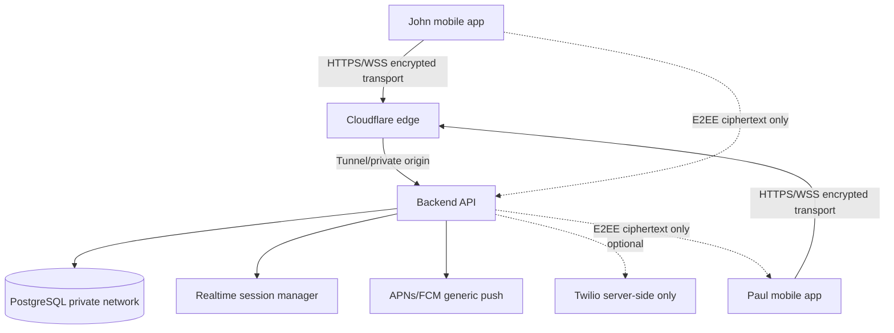
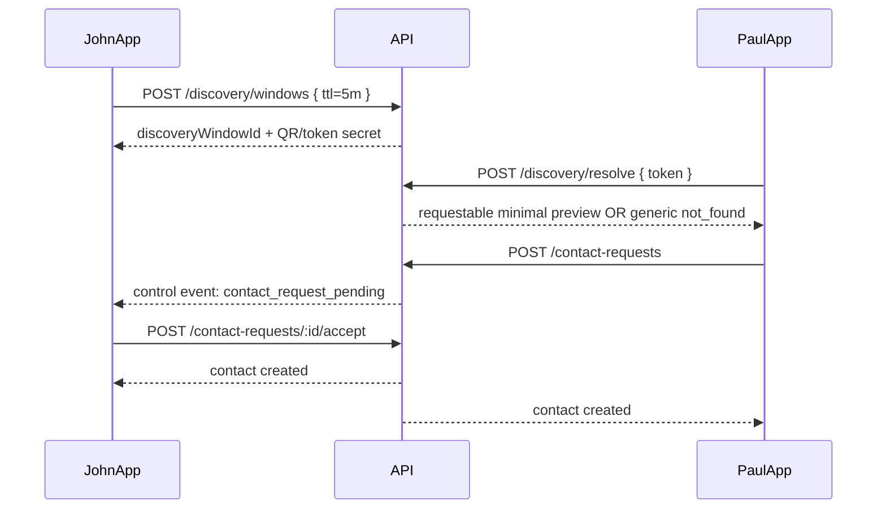
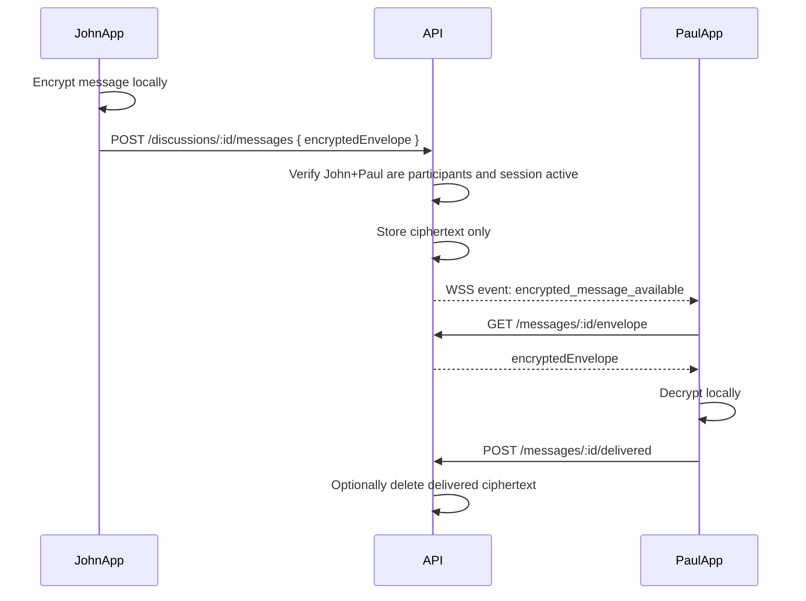
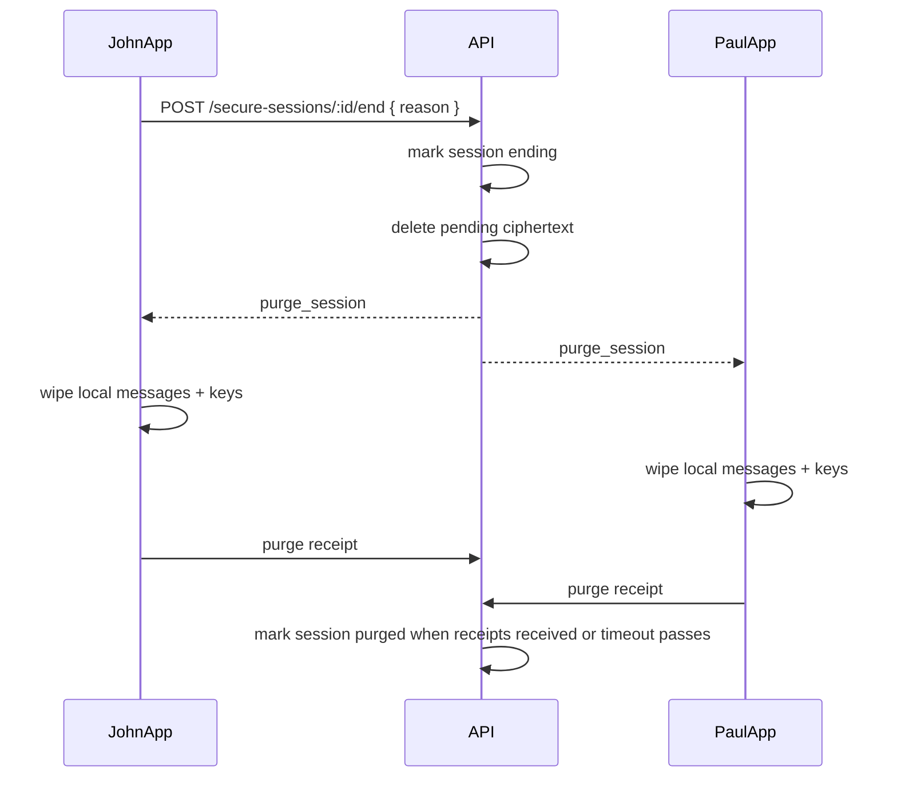

# Architecture

## Recommended MVP stack

```text
Mobile:        React Native + TypeScript
Backend:       Node.js 22+ + TypeScript + NestJS or Fastify
Database:      PostgreSQL
ORM:           Prisma
Realtime:      WebSockets
Crypto:        Proven E2EE library/protocol adapter, not custom crypto
Auth:          Passkey-ready WebAuthn path, device/session tokens
Storage:       No plaintext message storage; encrypted attachments only
Edge:          Cloudflare Tunnel or equivalent private origin
Twilio:        Optional voice/SMS fallback server-side only
```

## High-level system diagram



## Monorepo layout

```text
apps/mobile/
  src/
    screens/
    navigation/
    crypto/
    session/
    discovery/
    storage/
    native/screenshot/
apps/api/
  src/
    auth/
    devices/
    discovery/
    contacts/
    discussions/
    secure-sessions/
    encrypted-messages/
    control-events/
    twilio/optional/
packages/shared/
  src/types.ts
  src/schemas.ts
packages/crypto/
  src/CryptoEngine.ts
  src/FakeCryptoEngine.dev-only.ts
  src/adapters/
packages/db/
  prisma/schema.prisma
infra/
  docker-compose.yml
  cloudflare-tunnel.md
  env.example
docs/
```

## Trust boundaries

### Trusted only on user devices

- Decrypted message content
- Private identity keys
- Session keys
- Message keys
- Attachment keys

### Trusted on backend

- Auth/session verification
- Authorization checks
- Discovery window state
- Contact relationship state
- Routing of encrypted envelopes
- Generic push notifications
- Delete/purge coordination

### Not trusted

- Client-supplied `fromUserId`
- Client-supplied recipient phone numbers
- Client-supplied discussion membership claims
- Public network metadata
- Push notification providers for message secrecy
- Mobile OS screenshot prevention guarantees

## Core flow: timed private discovery



## Core flow: encrypted message



## Core flow: delete on disconnect



## Realtime behavior

- WebSocket connection authenticated with short-lived access token.
- Heartbeat every 5 seconds.
- Heartbeat timeout 15-30 seconds for network loss.
- Manual end/logout/background events end immediately.
- Server must reject messages after session status is not `ACTIVE`.

## Mobile local data rules

- Store private device keys in platform secure storage/keychain/keystore.
- Store decrypted messages in memory only where possible.
- If local cache is required, store encrypted cache and keep session key in memory.
- Wipe memory/cache on session end/background/logout.
- Hide app switcher previews.
- Use generic notifications.

## Backend logging rules

Allowed:

- request id
- user id
- device id
- discussion id
- secure session id
- event type
- timestamps
- redacted IP / coarse metadata if needed

Forbidden:

- plaintext messages
- decrypted attachments
- private keys
- full discovery token secrets
- Twilio auth token
- passkey private material
- recovery secrets
